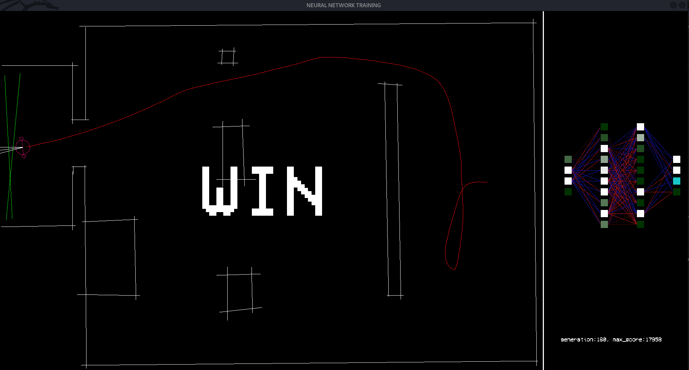
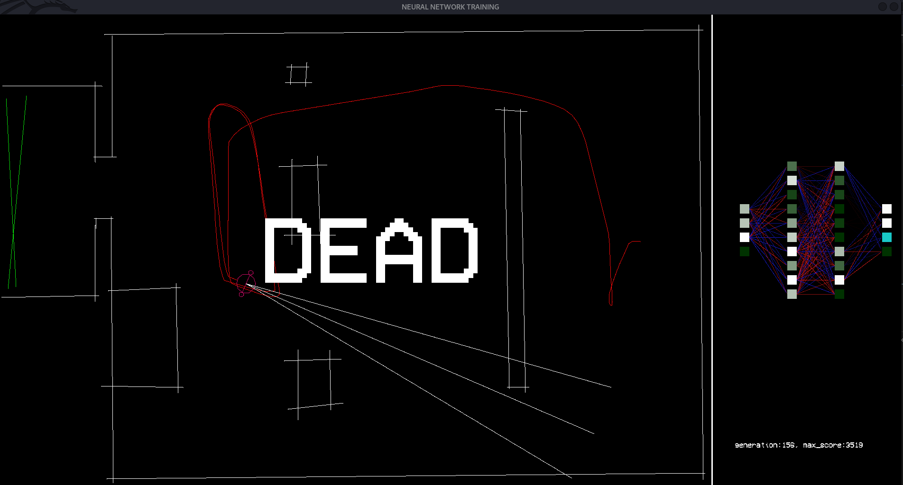
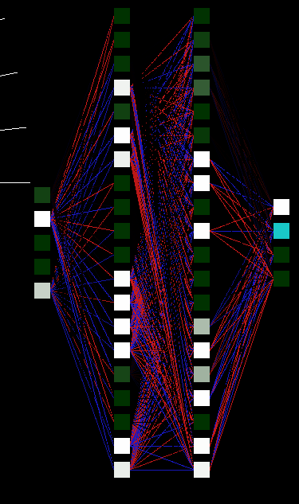
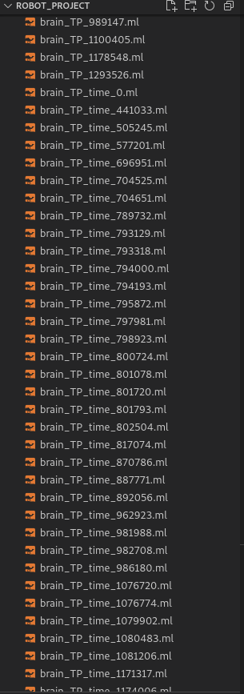

<h1>Robot project</h1>

<h3>Introduction</h3>

This project is a simulation of a robot in an environment that you choose to train a neural network through genetic algorithm and when the neural network is trained in a simulation 
Make it work in a real environment 

<h3>Installation</h3>

You have to install the sdl and sdl_ttf to make it work 
<code> ~$ sudo apt-get install build-essential libsdl-dev libsdl-ttf2.0-dev</code> 

Then you just have to use the makefile 
<code> ~$ make</code> 

<h3>How make it work</h3>

You have multiple program that you can use 
In one hand, you have the program <mark>app_map</mark> in the bin folder 
You can launch it with the command line <code> ~$ ./app_map</code> 
This program helps you to create some map where the robot will train and develop some abilities with all the difficulties it will meet in the environment 
 

You also have the main program which is <mark>app_training</mark> still in the bin folder 
You can launch it with the command line <code> ~$ ./app_training</code> 
And even put an neural network already train in the universe, you created with the app_map program 
To make it, you have to specify the path to the neural network's file in argument 
For example, <code> ~$ ./app_training ../resources/trained_model/brain_599071.ml</code> 
It will launch the simulation but the first neural network to train will be the neural network specify 

 

<h3>How to make map (with app_map)</h3>

There are some maps already made in the project, if you watch the code you can add map or even remove one of them. 
If you want to create a new map, you have to launch the program app_map 
Then you can use buttons to create the map 
Here the list of them : 
<table>
    <tr>
        <th>Button</th>
        <th>Use</th>
    </tr>
    <tr>
        <th>mousebutton_left</th>
        <th>White line(the robot will be dead if it goes on it)</th>
    </tr>
    <tr>
        <th>mousebutton_right</th>
        <th>Red Line(the robot will be dead if it goes on it) same as white but red</th>
    </tr>
    <tr>
        <th>mousebutton_left&&space_key</th>
        <th>Green Line(the robot will win the game if it reaches it)</th>
    </tr>
    <tr>
        <th>mousebutton_left&&u_key</th>
        <th>Point where the robot will appear on the map(the robot's orientation is random)</th>
    </tr>
    <tr>
        <th>enter_key</th>
        <th>It saves the map</th>
    </tr>
    <tr>
        <th>esc_key(one time)</th>
        <th>It will cancel the line you are making</th>
    </tr>
    <tr>
        <th>esc_key(two time)</th>
        <th>It will remove all the lines and points on the map</th>
    </tr>
    <tr>
        <th>CTRL && move the mouse</th>
        <th>You can travel the map and build a giant map if you want</th>
    </tr>
</table>

Finally when you have save the map, you have to rename the map in the folder resources, here <mark>resources/map/map.level</mark> 
You rename it for example map_5.level and after that you add the map to the code in main_training.cpp after line 123 <code>universe.addLevel("../resources/map_5.level");</code> 
Then you will have your new level and all the position in the robot's training. 

<h3>Training</h3>

The training is done with the program <mark>app_training</mark> 
The buttons you have to know to use the program are listed here: 
<table>
    <tr>
        <th>Button</th>
        <th>Use</th>
    </tr>
    <tr>
        <th>esc_key</th>
        <th>quit the program</th>
    </tr>
    <tr>
        <th>space_button</th>
        <th>Allow you to slow down the training and eventually watch the behavior of the robot</th>
    </tr>
    <tr>
        <th>enter_key</th>
        <th>save the best neural_network into a file where name of it is brain_{score}.ml</th>
    </tr>
</table>

and like said before you can reuse your neural network which were trained before, if you specifies it in argument 

<h3>How it works</h3>

It uses a genetic algorithm 
Which means it create a population (here it's a population of neural network with values randomly set) 
We wants this population to evolve so we will apply some function to them 
Firstly, we will score each of them and make a list where the strongest is the first one(high score) and the last one is the worst one(with the lower score) 
Then we apply a selection based on the score and we make them reproduce(which mean we mix theirs values) to create a new neural network and we add it on the next population 
One we have new babies, we add some mutations on them (it will change a little bit of theirs values inside the neural network) 
But we keep the first one without mutations in the new population 
And we fill the rest of the population with random new neural network 
 
We are on the next generation here, we do it in loop and it will evolve to create smart robot 

The used of multhreading helps to make quicker evolution... It reduces the time needed to have a neural network ready to go in real world !   

<h5>About the specification of the neural network</h5>

Here we have the structure of the neural network used in the final robot, over the project I had some changes about the structure of it. 
There are 3 things that can change the behavior of the neural network, it's the input, hidden layers and the output. 
We have 5 entries on the neural network : 
<ul>
    <li>rotation of the robot</li>
    <li>distance captured by the ultrasonic sensor</li>
    <li>memory 1</li>
    <li>memory 2</li>
    <li>time perception //added later and that made the robot worked well</li>
</ul>
 
We also have two hidden layers of 20 neurons each. 
and finally, the output of the neural network :  
<ul>
    <li>motor 1</li>
    <li>motor 2</li>
    <li>memory 1 (connected to the input 3)</li>
    <li>memory 2 (connected to the input 4)</li>
</ul>

<h3>Transfer To Arduino</h3>

After you have done a lot of neural network training, you will have a lot of trained model 

Once, you have picked one to try in the real world, you just have to follow the step bellow. 

The neural network is trained so we want to transfer it to arduino 
To make it, we will use the program <mark>extract_nn</mark> 
If it is not made, you just have to run<code> ~$ make</code> 
So now, you just have to go the bin folder and run <code> ~$ ./extract_nn</code> 
You will get this. 

Then you just have to copy and paste on your arduino program. 

It will load the neural_network trained on your computer on your robot ! 

I changed the machine_learning library on the arduino to keep all the values of the neural network 
in the script storage, otherelse it would have be complicated to store all the data of the neural network (2500bytes=> ~2,5Kb) inside the live memory (ram which is small) 

<h3>Graph of the evolution</h3>

There is a program <mark>display_stat.py</mark> 
Which you can use to see the evolution of each of your neural network 
Give the program the right to be launch <code> ~$ chmod +x display_stat.py </code> 
You just have to launch it, <code> ~$ ./display_stat.py </code> 
Then you will see this 

Once, you have choose your file, it will display the evolution 

 
I have learn a lot of my own on this project, you can use it to do something on your own too ! 
 
Have funnn!

